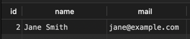
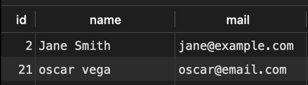
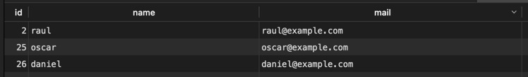
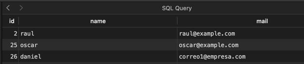
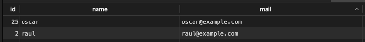
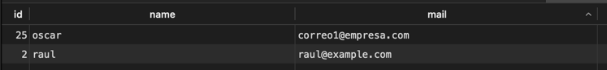

# Practical Task 

## Implementación de Transacciones
En esta mejora, aseguramos que la creación de un Employee y su User asociado sean transaccionales. Esto significa que si la creación del Employee falla, el user tampoco se guardará, evitando estados inconsistentes en la base de datos.

## Ejemplo

Actualmente nuestra base de datos contiene la siguiente informacion:

users:


employees:



Si procedemos a la ejecucion de nuestro sistema al intentar agregar un employee el cual es obligatoriamente un usuario y ocurre un error en el proceso
````
 [MENÚ PRINCIPAL]
1. Gestión de empleados
2. Gestión de usuarios
3. Gestión de proveedores
4. Gestión de assets
5. Gestión de compras
6. Gestión de movimientos
7. Salir
Seleccione una opción: 1

 ----- GESTIÓN DE EMPLEADOS ----- 
1. Agregar empleado
2. Editar empleado
3. Eliminar empleado
4. Listar empleados
5. Volver al menú principal
Seleccione una opción: 1
Ingrese el nombre del empleado: oscar vega
Ingrese el correo del empleado: oscar@email.com
Exception in thread "main" java.lang.RuntimeException: Error simulado antes de crear el usuario
	at com.InventoryManager.repositories.EmployeeRepository.save(EmployeeRepository.java:38)
	at com.InventoryManager.menus.EmployeeMenu.addEmployee(EmployeeMenu.java:55)
	at com.InventoryManager.menus.EmployeeMenu.showMenu(EmployeeMenu.java:38)
	at com.InventoryManager.main.MenuHandler.showMainMenu(MenuHandler.java:33)
	at com.InventoryManager.main.Main.main(Main.java:8)
````
y revisamos la db en la tabla employees
Antes de los cambios: Un Employee podía existir sin su User, creando inconsistencias.

Podemos observar que se guardo el registro en employees mas no en users




Lo anterior genera inconsistencia ya que todo employee es un user
Haciendo los siguiente (uso de transacciones) el escenario anterior se puede evitar, manteniendo consistencia en nuestra db

Después de los cambios: Ahora, o se crean ambos registros, o ninguno se guarda, asegurando consistencia.

Conclusión:

Mejoramos la integridad de datos y el uso eficiente de transacciones para ello se agregaron metodos transaccionales a la clase DBController
y se refactorizo el metodo save de la clase EmployeeRepository

## Implementación de Transacciones
En esta mejora se aborda la problematica si dos administradores estan actualizando el correo de un employee.
Actualmente ante esta situacion lo que ocurriria es que ambos adminstradores actualizarian sin saber del otro y podrian guardarse datos no esperados en la db

## Ejemplo
Supongamos la siguiente informacion en employees



Ahora supongamos que dos administradores (representados por hilos) desean modificar el correo de el id 26 daniel
  

```
 ----- GESTIÓN DE EMPLEADOS ----- 
1. Agregar empleado
2. Editar empleado
3. Eliminar empleado
4. Listar empleados
5. Volver al menú principal
6. Simulacion -> Concurrencia al editar un empleado
Seleccione una opción: 6
ID del empleado a editar en concurrencia: 26

 ----- GESTIÓN DE EMPLEADOS ----- 
1. Agregar empleado
2. Editar empleado
3. Eliminar empleado
4. Listar empleados
5. Volver al menú principal
6. Simulacion -> Concurrencia al editar un empleado
Seleccione una opción: 6
Hilo 2 completó actualización.
Hilo 1 completó actualización.

```

Lo anterior nos da como resultado el siguiente  resultado en la tabla:



Se perdieron los datos del administrador 2 (Hilo 2).

En cambio agregando SERIALIZABLE (isolation) podemos notar obtendriamos lo sigueinte



```
 ----- GESTIÓN DE EMPLEADOS ----- 
1. Agregar empleado
2. Editar empleado
3. Eliminar empleado
4. Listar empleados
5. Volver al menú principal
6. Simulacion -> Concurrencia al editar un empleado
Seleccione una opción: 6
ID del empleado a editar en concurrencia: 25

[DBController] Isolation level aplicado: SERIALIZABLE
[DBController] Isolation level aplicado: SERIALIZABLE
Hilo 1 completó actualización.
Exception in thread "Thread-1" java.lang.RuntimeException: Error executing query UPDATE employees SET name = ?, mail = ? WHERE id = ?
	at com.InventoryManager.utilities.DBController.execute(DBController.java:94)
	at com.InventoryManager.repositories.EmployeeRepository.update(EmployeeRepository.java:86)
	at com.InventoryManager.menus.EmployeeMenu.lambda$simulateConcurrentEdit$1(EmployeeMenu.java:136)
	at java.base/java.lang.Thread.run(Thread.java:840)
Caused by: org.postgresql.util.PSQLException: ERROR: could not serialize access due to concurrent update
```


Notese que el el primer hilo que realizó commit (Hilo1) fue el que actualizó los datos en la db
mientras que el segundo genereo el ERROR "could not serialize access due to concurrent update"

Conclusión: Gracias al asilamiento podemos mantener la integridad de la base de datos cuando hay concurrencia en alguna parte de la misma.

