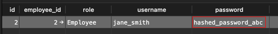
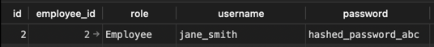

# Practical Task 

## Implementación de Transacciones
En esta mejora, aseguramos que la creación de un Employee y su User asociado sean transaccionales. Esto significa que si la creación del Employee falla, el user tampoco se guardará, evitando estados inconsistentes en la base de datos.

## Ejemplo

Actualmente nuestra base de datos contiene la siguiente informacion:

users:


employees:


Si procedemos a la ejecucion de nuestro sistema al intentar agregar un employee el cual es obligatoriamente un usuario y ocurre un error en el proceso
````
 [MENÚ PRINCIPAL]
1. Gestión de empleados
2. Gestión de usuarios
3. Gestión de proveedores
4. Gestión de assets
5. Gestión de compras
6. Gestión de movimientos
7. Salir
Seleccione una opción: 1

 ----- GESTIÓN DE EMPLEADOS ----- 
1. Agregar empleado
2. Editar empleado
3. Eliminar empleado
4. Listar empleados
5. Volver al menú principal
Seleccione una opción: 1
Ingrese el nombre del empleado: oscar vega
Ingrese el correo del empleado: oscar@email.com
Exception in thread "main" java.lang.RuntimeException: Error simulado antes de crear el usuario
	at com.InventoryManager.repositories.EmployeeRepository.save(EmployeeRepository.java:38)
	at com.InventoryManager.menus.EmployeeMenu.addEmployee(EmployeeMenu.java:55)
	at com.InventoryManager.menus.EmployeeMenu.showMenu(EmployeeMenu.java:38)
	at com.InventoryManager.main.MenuHandler.showMainMenu(MenuHandler.java:33)
	at com.InventoryManager.main.Main.main(Main.java:8)
````
y revisamos la db en la tabla employees
Antes de los cambios: Un Employee podía existir sin su User, creando inconsistencias.

Podemos observar que se guardo el registro en employees mas no en users




Lo anterior genera inconsistencia ya que todo employee es un user
Haciendo los siguiente (uso de transacciones) el escenario anterior se puede evitar, manteniendo consistencia en nuestra db

Después de los cambios: Ahora, o se crean ambos registros, o ninguno se guarda, asegurando consistencia.

✅ Mejoramos la integridad de datos y el uso eficiente de transacciones para ello se agregaron metodos transaccionales a la clase DBController
y se refactorizo el metodo save de la clase EmployeeRepository

